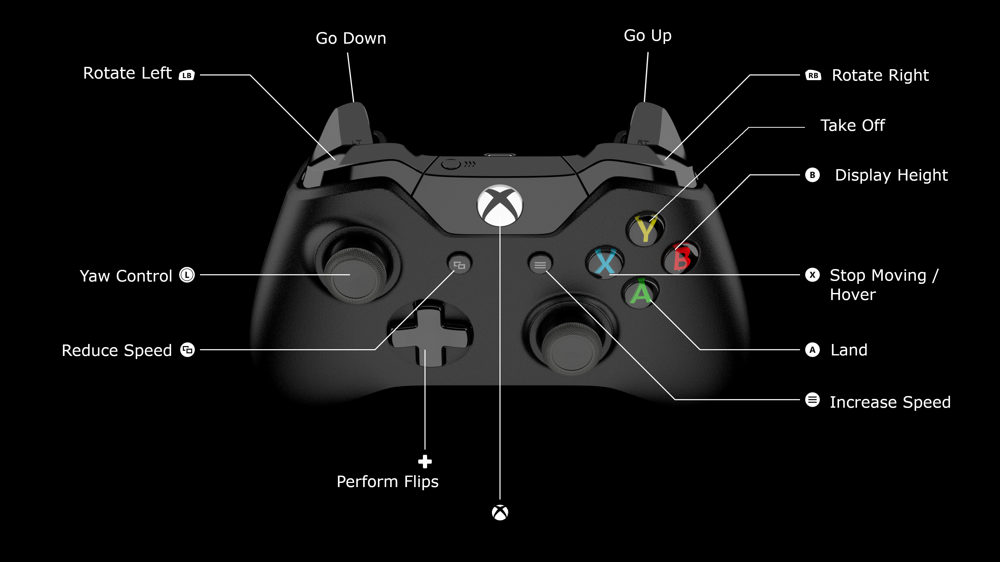

# DJITello_Xbox_Controller

## Description

This project lets you control your DJI Tello Drone with an Xbox One Controller. 
You can perform all actions that are available on Official Tello App.  

## Table of Contents

- [Installation](#installation)
- [Usage](#usage)
- [Features](#features)
- [Controls Documentation](#controls-documentation)
- [Contributing](#contributing)

## Installation
Requires `Python 3.6` and above
- Step 1: Clone this repository to your system
- Step 2: Install pip by running `python -m ensurepip --default-pip` 
- Step 3: Navigate to the project and run `pip install -r requirements.txt` to install pre-requisites

## Usage
- Turn on Tello Drone and connect to the drone's WiFi
- Connect your Xbox Controller to your PC
- Run `python main\TelloFlightController.py` to launch the script

## Features
Using Controller, the drone can:
- Takeoff
- Land
- Force hover 
- Yaw forward, backward, left and right
- Rotate clock & anti-clockwise on x-axis
- Perform flips (front, back, left, right)
- Go up and down on y-axis
- Shows Drone's height

## Controls Documentation

## Contributing

If you encounter any bug, feel free to raise it here.